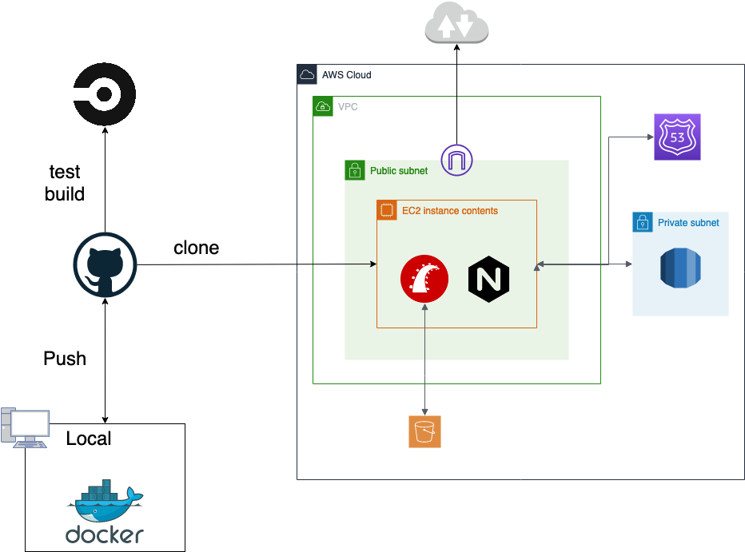

# TAKEMON概要

作品記事投稿用SNSです。
Twitterで一昔前に流行った「バズったので宣伝」が好きだったので専用のSNSがあればと思い作成しました。
ゲストユーザーでもログインできます。画面右上の「ログイン」→「ゲストユーザーでログイン」でログインできます。
https://www.takemon.work/

<トップページ画面>

<作品詳細画面>

# 機能一覧

- ログイン/ログアウト機能
- ゲストユーザーログイン機能
- ログイン保持機能
- ユーザー登録/更新/削除機能
- 作品記事投稿/編集/削除機能
- お気に入り機能
- 単体/結合/E2Eテスト自動化

# 使用技術

### アプリケーション

- Ruby v2.6.6
- Ruby on Rails v6.0
- BootStrap v4.3
- jQuery
- MySQL 8.0

### インフラ

- AWS（使用しているサービスについてはインフラ構成図参照）
- Docker-Compose（ローカル開発環境）
- CircleCI（自動ビルド・自動テスト）

# インフラ構成図

<インフラ構成図>

